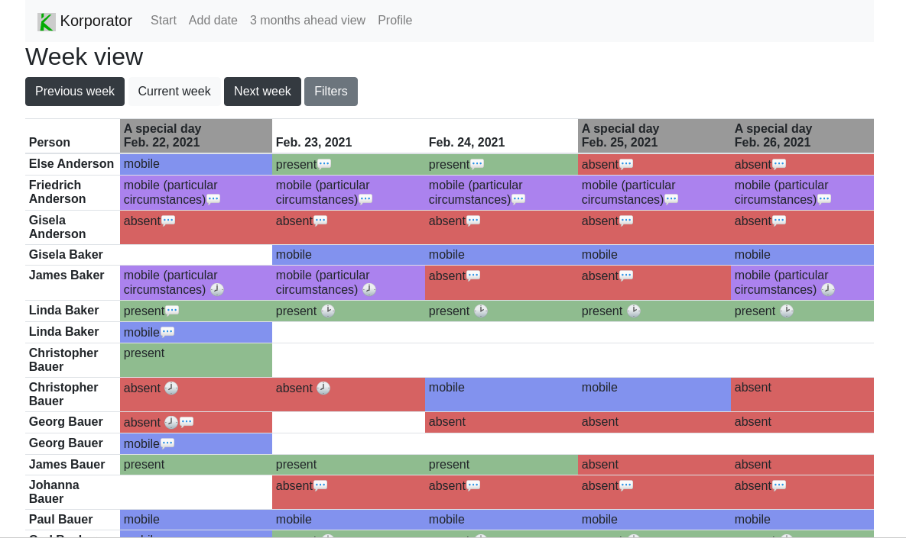

# Frontpage

The front page starts with a week view.

## Parameters

The front page supports these query parameters:

* `weekdelta`: a number (positive or negative) as a delta to the current week.
* `orgunit`: the id of an organizational unit. The list gets filtered when a value is provided.
* `users`: a comma separated list of _usernames_. The list gets further filtered when a value is provided.
* `embed`: can be set to `1` to hide some elements, e. g. inside an iframe.

## Buttons

### Previous week

Move the displayed week backwards one week.

### Current week

Jump back to current week.

### Next week

Show items of the following week.

### Filters

Opens a filter panel. The panel allows adjusting the selected organizational unit and jump to a specific date.
