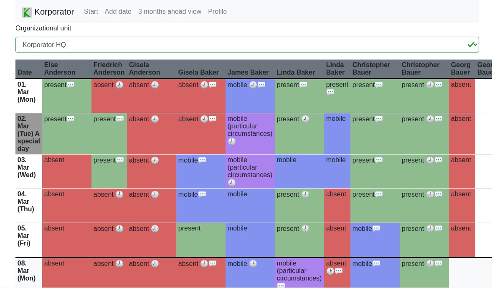

# 3 months ahead view

The page _3 months ahead view_ shows all upcoming items in the next three months.

## Parameters

The page supports these query parameters:

* `orgunit`: the id of an organizational unit. The list gets filtered when a value is provided.
* `fd`: _from date_, can be set to the starting date for the result, format it `YYYY-MM-DD`
* `td`: _t date_, can be set to the end date for the result, format it `YYYY-MM-DD`
* `embed`: can be set to `1` to hide some elements, e. g. inside an iframe.
